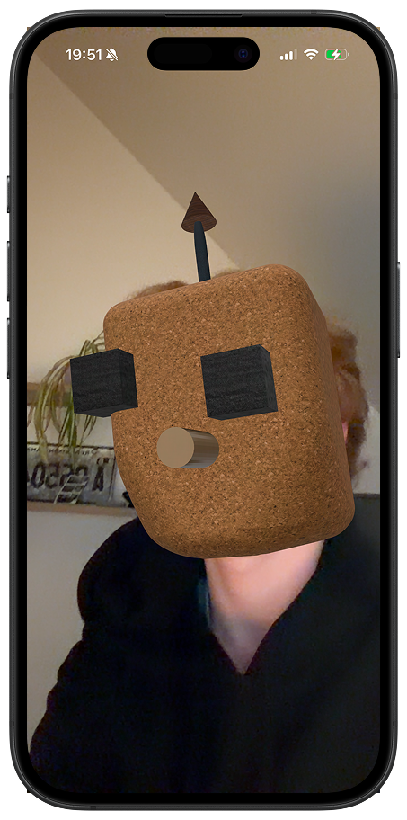
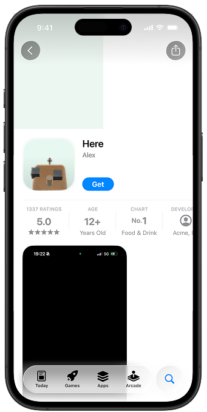
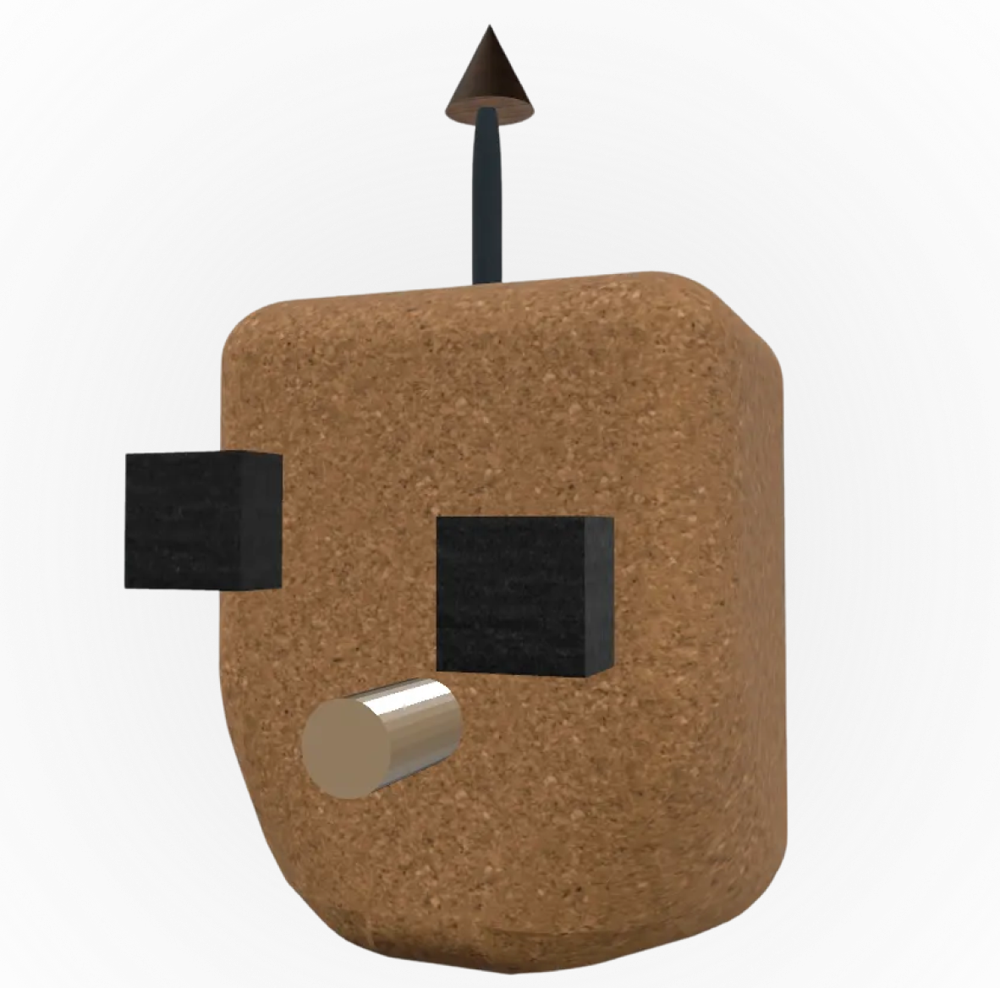

# Application iOS - Arts Plastiques

> Projet de Terminale - Option Arts Plastiques

## Problématique

**Comment faire interagir lumière, matière et espace ?**

- Lumière : ce qui éclaire
- Matière : ce qui est matériel  
- Espace : ce qui prend de la place (ou pas)

---

## Aperçu

  
  
  

---

## Concept

Ce projet explore une approche paradoxale en utilisant une application iOS de réalité augmentée pour dénoncer l'illusion du virtuel. Contrairement aux attentes initiales de la problématique, l'application ne crée aucune interaction réelle avec la lumière, la matière ou l'espace. Cette absence d'interaction constitue précisément le cœur de la démarche artistique. Le virtuel cache ici le virtuel : il n'existe aucune relation physique avec l'élément numérique présenté, seulement une illusion d'existence sans substance. L'œuvre n'existe que par celui qui l'utilise, questionnant ainsi notre perception du réel et du virtuel. C'est cette inversion du sujet initial qui donne tout son sens au projet, en révélant qu'il n'a fondamentalement pas lieu d'être et en invitant à une remise en question des notions d'interaction et de matérialité dans l'ère numérique.

---

## Technologies

- Swift
- iOS
- ARKit

---

## Contexte

Projet réalisé dans le cadre de l'option Arts Plastiques en Terminale, présenté à l'oral avec une démarche conceptuelle questionnant les notions de réalité, virtualité et interaction.
